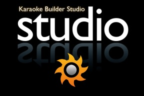

Karaoke Builder Studio
======================

`Karaoke Builder Studio <https://www.karaokebuilder.com/kbstudio.php>`_ is used by the plurality if not the majority of diveBar creators at this point. It does look old, and is very much designed around the CDG format, but it is surprisingly capable, and there are a lot of keyboard shortcuts for efficient usage. It is Windows software (though it does mostly work in Wine as well). In addition to the lyric syncing capabilities, it includes software for making CDG slideshows that can be embedded into the main project, typically used for title cards and break graphics, and software for playing CDGs.

The following are two great starting tutorials:

.. youtube:: X7f32vvxAV4
   :privacy_mode:

`Karaoke Builder Studio - Basics Tutorial <https://youtu.be/X7f32vvxAV4>`_ - From Karaoke from Space

.. youtube:: ZuXkGlCQH70
   :privacy_mode:

`Creating a karaoke video from start to finish (Update #1) <https://youtu.be/ZuXkGlCQH70>`_ - From Karaoketuottaja

There are also some tutorials from JDCrooner `on a Google Drive <https://drive.google.com/drive/folders/1ldpLEBTzjAxQdClTT8LOzPPiglfu0Q2v?usp=sharing>`_.

Video Output
------------

KBS does support exporting video, but anything above CDG resolution uses nearest-neighbor scaling of the text rendered at CDG resolution, so it will look blocky. It also does not have great codec options for export. There are two ways to work around these limitations:

* Use an upscaler on the CDG output (`Power CDG to Video <https://www.powerkaraoke.com/src/prod-ultimate-cdg-karaoke-video-converter.php>`_ referenced in above tutorials)
* Use a converter to render the text at full resolution

  * KBS supports exporting the lyric timing as a .lrc file which can then be imported into other software
  
  * `kbp2ass <https://github.com/ItMightBeKaraoke/kbp2ass>`_/`kbp2video <https://github.com/itmightbekaraoke/kbp2video>`_ read in the KBS project file (.kbp) and convert to a subtitle that can be burned into video

    * See kbp2ass tutorial from Rose: `My Entire process from start to finish <https://youtu.be/PPfBBqCOKlQ>`_

    * kbp2video demo from It Might Be Karaoke: `Remaster and kbp2video demo <https://youtu.be/iKZOuOYnmDU>`_

  * Kadda OK's tool reads in the KBS project file and converts to YouTube Movie Maker format, where it can be further edited (see `The Best Way to Make Karaoke in 2023 - With HD Graphics!  (Full walkthrough) <https://youtu.be/WKDIhErILac>`_)

My (It Might Be Karaoke) current recommendation is to use **kbp2video** except for some specific use cases:

* If you absolutely need CDG output and want to use the slides feature in KBS, you might be better off just using an upscaler. Your text won't look as good on the video version, but it would be extra effort to otherwise maintain both CDG and video as you'd have to duplicate work with the slides.

* If you want to significantly customize the output/layout or are already familiar with YouTube Movie Maker, Kadda OK's tool will probably be more useful

* If you need to script your conversions instead of using a GUI, you could use kbp2ass for that, but more preferable at this point is probably to use `kbputils <https://github.com/itmightbekaraoke/kbputils>`_, the python module kbp2video now uses for conversion, that also offers a CLI.

Get Started
-----------

Karaoke Builder Studio is the software of choice in our :doc:`Windows <qs-windows>` and :doc:`Linux <qs-linux>` Quick Start guides.
