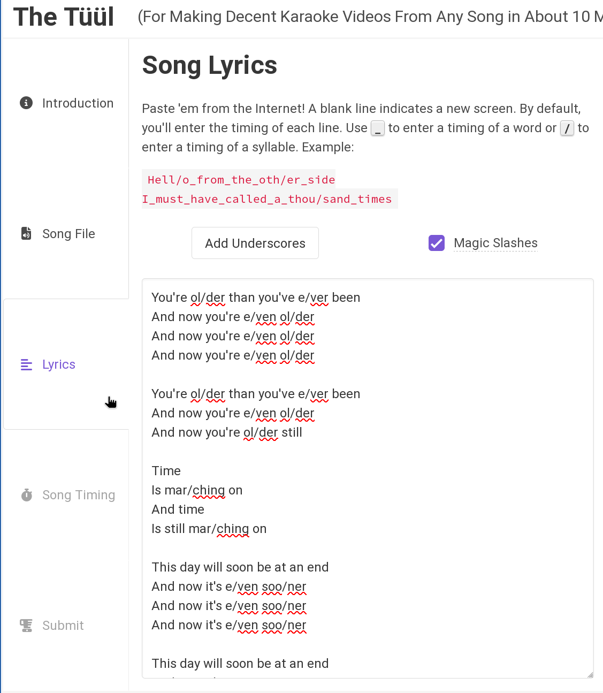
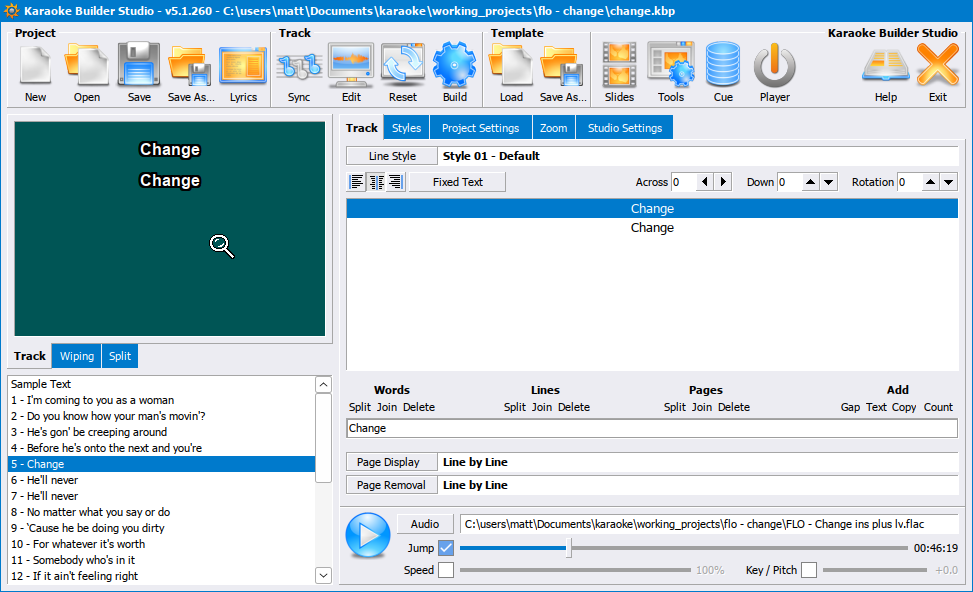

Linux Quick Start
=================

.. include:: qs-disclaimer.inc

Install Required Software
-------------------------

First, ensure you have `wine <https://www.winehq.org/>`_ installed. We are going to use it to run Karaoke Builder Studio. Almost all Linux distros have it in their repos and  just call the package "wine". There's no need to make sure you have the latest from WineHQ - every version I've tried has worked fine.

Next proceed with KBS:

:download:`Download Karaoke Builder Studio <https://www.karaokebuilder.com/download/kbstudio.exe>`

Wine is likely to be your default handler for .exe, so you can probably just double-click the installer like on Windows. If not, it should be in your right-click "Open With" menu or equivalent, or failing that, just manually run "wine kbstudio.exe" from the directory where it's been downloaded.

.. include:: qs-x-minus.inc

.. include:: qs-lyrics.inc

.. include:: qs-kbs.inc

CDG Output
----------

CDG output is possible in Linux, but it is a little tricky to get working. You need to ensure Anti-aliasing/sub-pixel hinting is disabled in your window manager when you launch KBS. You can turn it back on after starting KBS. There are settings in Wine related to font smoothing, but they don't seem to have any effect, at least in modern version of Wine. You can verify if your font hinting settings are properly disabled by viewing the full screen preview by clicking on the preview box from the main screen.

If you have hinting turned on, you'll see multiple colors or shades of gray.

What you want to see is solid colors.

Once you've confirmed you have it configured correctly, you can generate a CDG through the Build button. Note that if you're using the trial of KBS, the output will not be fully usable, but will be good enough to see that it worked.

The Slides feature (not covered by this tutorial, but commonly used with CDG output) does not currently work in Wine - it seems to be an issue with the ole32 and oleaut32 implementations.

.. include:: qs-kbp2video.inc

1. Open a terminal and create a Python3 venv:
   
   .. code-block:: bash

      mkdir kbp2video_venv
      cd kbp2video_venv
      python3 -m venv .
      . bin/activate

2. Install kbp2video into it, then you can run it

   
   .. code-block:: bash

      pip install kbp2video
      kbp2video

   To access in the future, you can either run the ``activate`` and ``kbp2video`` again, or just use the bin/kbp2video script it created directly.

   .. image:: images/kbp2video-linux.png
      :alt: Screenshot of kbp2video UI

3. Drag and drop your .kbp file into the UI.

4. Hit the Convert to Video button.

Now you should have a kbp2video folder alongside the project and a nice mp4 video file in it.

.. include:: qs-youtube.inc

Follow-up steps
---------------

* Learn more about Karaoke Builder Studio with some :doc:`background and video tutorials <kbs>`.
* View a :doc:`comparison of karaoke software <graphics_software>` to see if any would work better for you.
* Read about :doc:`vocal_isolation` and :doc:`uvr` to help decide if you want to continue with x-minus or try one of the other options. Note that it can be a little tough to get UVR running on Linux since they don't provide an installer or package for it.
* `Buy/Register Karaoke Builder Studio <https://www.karaokebuilder.com/buy.php>`_
* Purchase a subscription for `x-minus <https://x-minus.pro/ai>`_ (click the link to try Premium)
* Install Audacity to edit your audio files if the stems directly from x-minus aren't quite good enough (it should be in your distro's repo).
* Set up a :doc:`Google Drive <google-drive>` for KJs to use for offline shows.
* :ref:`Apply for a channel <joining:Requesting a Channel>` on the Discord (once you get to 10 videos).
