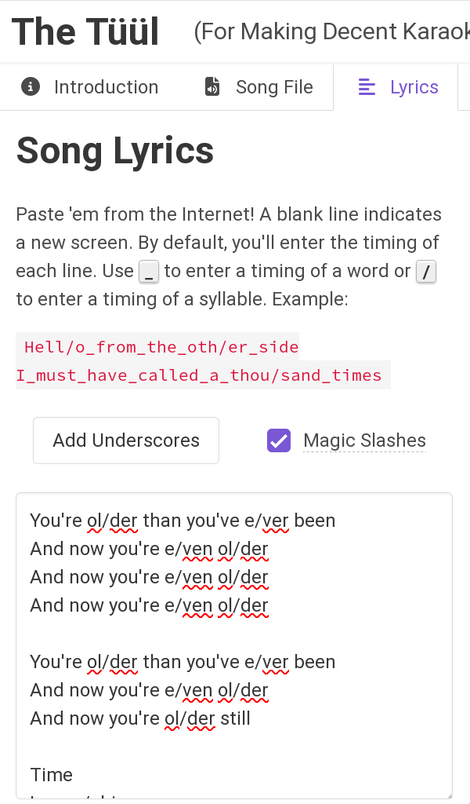

Mobile Quick Start
==================

.. include:: qs-disclaimer.inc

Install Required Software
-------------------------

Install the YouTube Studio app for `Android <https://play.google.com/store/apps/details?id=com.google.android.apps.youtube.creator>`_ or `iOS <https://apps.apple.com/us/app/youtube-studio/id888530356>`_ as applicable.

Getting Started
---------------

Go to `The Tüül <https://the-tuul.com/>`_. We will be creating the whole video using this site, which has both a desktop and mobile interface.

Upload Song
-----------

1. Click the Song File tab at the top and upload the original song, in as high quality as possible.

2. The Tüül will try to auto-detect the artist and title. If they are wrong, correct them. This info is displayed at the start of the track in the output video.

   .. image:: images/qs-tuul-mobile-song.png
      :alt: Screenshot of The Tüül mobile interface, showing Song File tab

3. The Tüül will process the file in the background while you work on the other steps.

.. include:: qs-lyrics.inc

Finally, click the Add Underscores button in the UI so syncing will operate word by word instead of a line at a time.

Syncing Track
-------------

1. Switch to the Song Timing tab and hit Play to start syncing.

   .. image:: images/qs-tuul-mobile-timing.png
      :alt: Screenshot of The Tüül mobile interface, showing Song Timing tab

2. Tap the "Spacebar" button at the bottom of the screen as each syllable starts and "Enter" at the end of a word when there is a long gap between words.
3. At the very end of the lyrics, hit the "Enter" button to finalize the sync.

Video Output
------------

1. Go to the Submit tab and you can preview the sync. It will still play the unseparated audio.

   .. image:: images/qs-tuul-mobile-submit.png
      :alt: Screenshot of The Tüül mobile interface, showing Submit tab

2. If you are satisfied, hit the Create Video button and it will finish processing (may take a few minutes) and provide you with a zip file containing the mp4 file as well as some additional files you can disregard for now.
3. Extract the mp4 file from the zip.

Upload to YouTube
-----------------

1. `Create a channel <https://www.youtube.com/create_channel>`_. You can use an existing Google account, but it's better if you create a new one.
2. Open the YouTube Studio app and sign into your account/select your channel. 
3. Click the circled plus icon at the top of the app, near the middle.
4. Select your video file.
5. Edit the title and description and wait for it to upload and process.

Follow-up steps
---------------

* Learn more about The Tüül with some :doc:`background and video tutorials <the_tuul>`
* View a :doc:`comparison of karaoke software <graphics_software>` to see if any would work better for you.
* Set up a :doc:`Google Drive <google-drive>` for KJs to use for offline shows.
* :ref:`Apply for a channel <joining:Requesting a Channel>` on the Discord (once you get to 10 videos).
