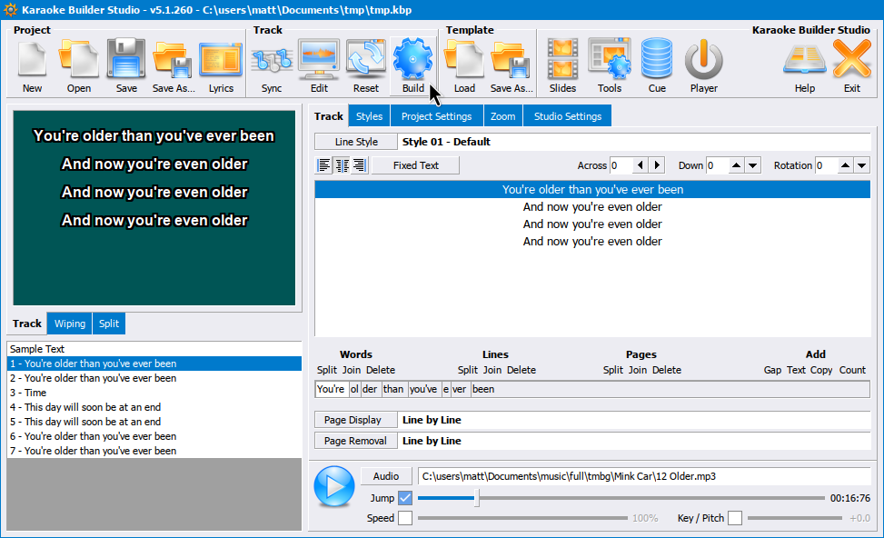

Windows Quick Start
===================

.. include:: qs-disclaimer.inc

Install Required Software
-------------------------

:download:`Download Karaoke Builder Studio <https://www.karaokebuilder.com/download/kbstudio.exe>`

This is the software we'll use to sync lyrics. It is a paid product, but the free trial will be enough for you to test if it will work for you. Yes, it does look like it's from the 90s, but for now please just trust the process.

.. include:: qs-x-minus.inc

.. include:: qs-lyrics.inc

.. include:: qs-kbs.inc

CDG Output
----------

Once the syncing is complete and audio is swapped out, hit Build and generate a CDG. You're technically done. Note that if you are using the trial of KBS, the output will not be fully usable, but will be good enough to see that it worked.

.. include:: qs-kbp2video.inc

1. :download:`Download kbp2video <https://itmightbekaraoke.com/kbp2video/current.exe>` and install it.
2. Launch it from the start menu.

   .. image:: images/kbp2video.png
      :alt: Screenshot of kbp2video UI

3. Drag and drop your .kbp file into it.
4. Hit the Convert to Video button.

Now you should have a kbp2video folder alongside the project and a nice mp4 video file in it.

.. include:: qs-youtube.inc

Follow-up steps
---------------

* Learn more about Karaoke Builder Studio with some :doc:`background and video tutorials <kbs>`.
* View a :doc:`comparison of karaoke software <graphics_software>` to see if any would work better for you.
* Read about :doc:`uvr` to help decide if you'd rather run your vocal isolation locally rather than with x-minus.
* `Buy/Register Karaoke Builder Studio <https://www.karaokebuilder.com/buy.php>`_
* Purchase a subscription for `x-minus <https://x-minus.pro/ai>`_ (click the link to try Premium)
* Download `Audacity <https://www.audacityteam.org/download/windows/>`_ to edit your audio files if the stems directly from x-minus aren't quite good enough.
* Set up a :doc:`Google Drive <google-drive>` for KJs to use for offline shows.
* :ref:`Apply for a channel <joining:Requesting a Channel>` on the Discord (once you get to 10 videos).
