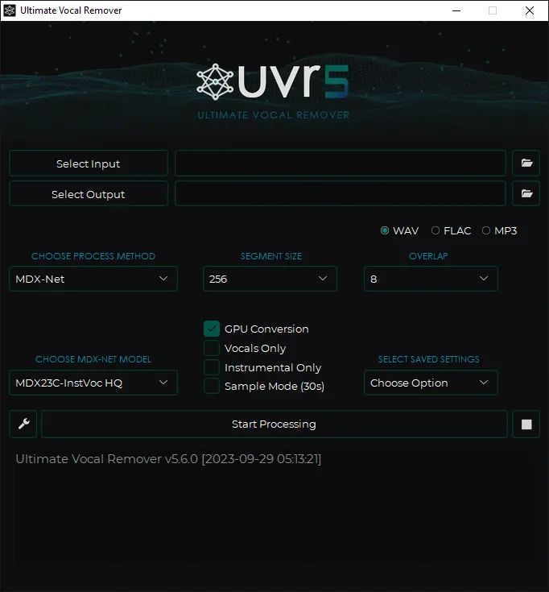

Ultimate Vocal Remover (UVR)
============================

`Ultimate Vocal Remover <https://github.com/Anjok07/ultimatevocalremovergui>`_ is a GUI app for separating audio. It provides many models and can create ensembles of multiple models.

They provide installers for Windows and Mac (including M1+), and manual installation is possible on Linux. CPU conversion is supported, though it's slow (roughly 10 mins per song for a basic model), as well as nVidia and M1 GPUs, and limited support for AMD and Intel Arc GPUs.

Not all models will be installed automatically. To install additional models, you can click the wrench icon to get to the main settings menu, then go to the Download Center tab. You may need to hit the Refresh List button before all the models are available in the dropdowns.

There are a lot of advanced options available, but the basic workflow is

#. Select your input file(s). Multiple can be selected to be processed at once if they are in the same folder.
#. Select your output folder.
#. Select your processing method - This is the type of model to use, including Ensemble if you want to combine multiple.
#. Select your particular model.
#. Hit Start Processing. It will create the new files in your output folder, named how you have configured in the settings.

The author of the software is in the Discord, but please don't ping them directly with basic usage questions. Instead, ask in `#vocal-isolation <https://discord.com/channels/918644502128885760/918681357562036246>`_. If nobody there knows the answer, we can bring in the expert.
