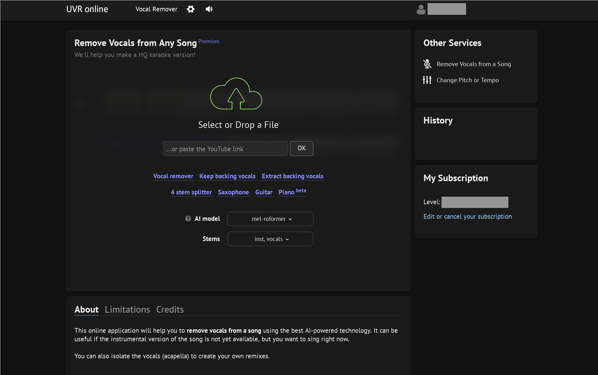

x-minus.pro / UVR Online
========================

`x-minus <https://x-minus.pro/ai?hp>`_  provides an easy-to-use web-based user interface for removing vocals. Some functionality is available for free, but purchasing a subscription is recommended (they currently use Boosty, but they used to offer Patreon and may be able to go back to it in the future). Note that when you are logged into the paid version, you may see the branding/domain change to UVR online/uvronline.app but it is the same site, it just helps them keep the versions separate.

To process a file, set the AI model in the dropdown menu and any options for it that may come up, then drag and drop your original audio file. The model it picks by default is usually the best *instrumental* model it has available. There are also some shortcuts for their other recommendations (the light blue links). To define some of the terms they mean in shortcuts:

* Vocal remover - This should normally be the same instrumental model they recommend when you first load the site
* Keep backing vocals - This is a karaoke model, meaning it attempts to separate lead vocals from instruments and backing vocals
* Extract backing vocals - This is a model that will separate backing vocals from instruments and lead vocals
* 4 stem splitter - This splits into drum, bass, guitar, and vocals

There is additional detail about all the models if you hover over the question mark icon next to "AI model". This also explains some of the Ensemble options that will be available after you run the base model.

Once you run the model, you'll be able to select a file type (we recommend flac, though they'll default you to mp3), then download each stem. There are also options in some cases to run additional processing which will generate new stems. Note that you can't go back and re-download a previous separation at a later time, so make sure to download them right away. It's usually best to download all of them even if you think you only need the instrumental, because you may find the need to edit later.
